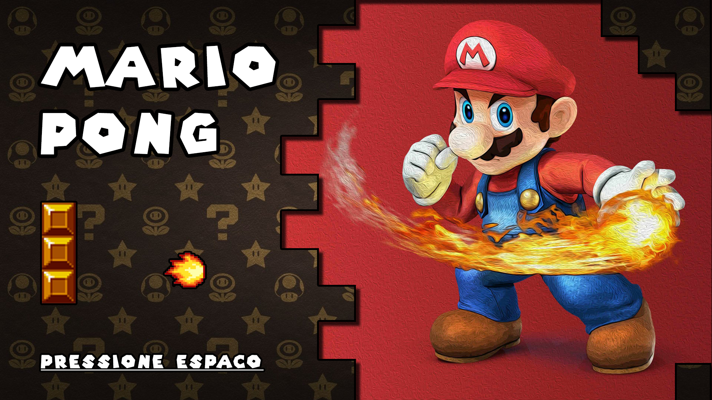
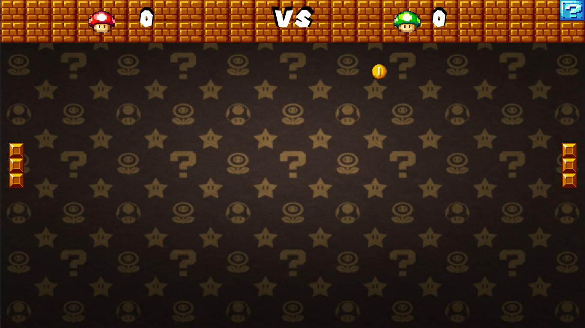
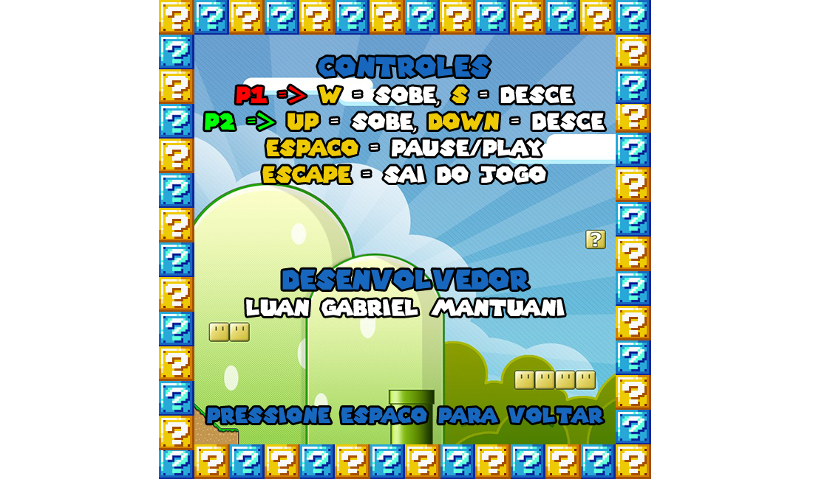
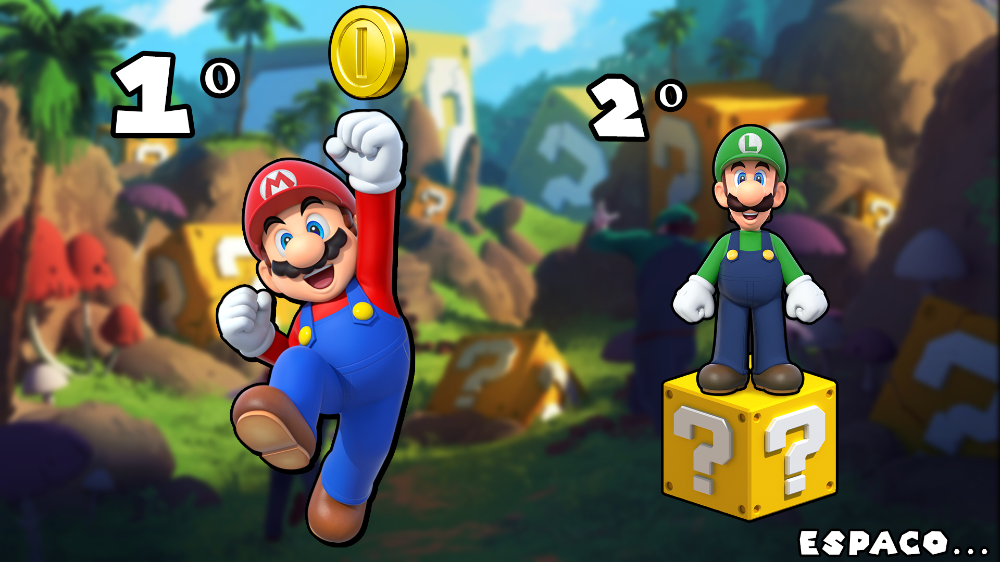
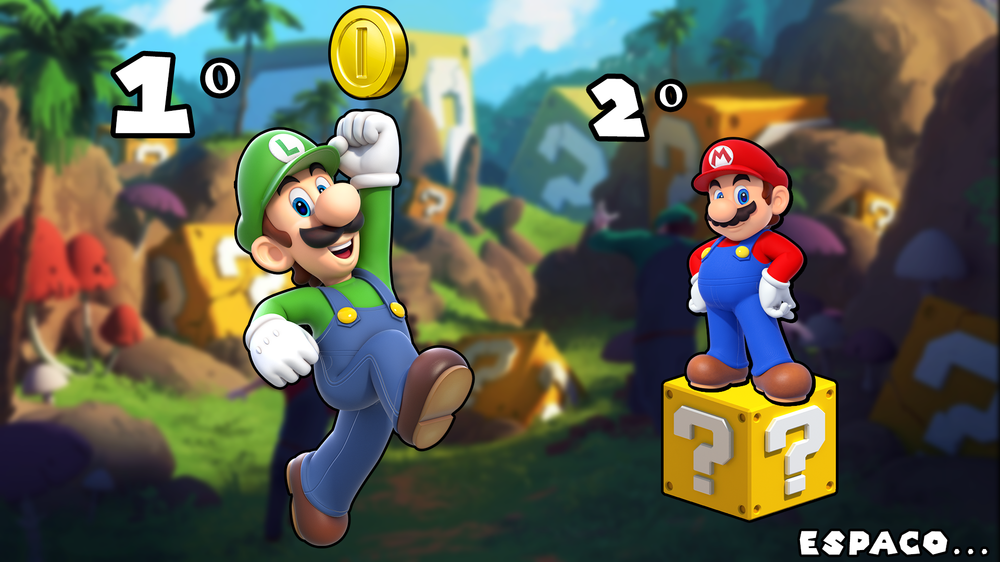

# Mario Pong
**Mario Pong** é um jogo de ping-pong com a tematica da serie de games do Super Mario.
 
## Projeto
O game foi densenvolvido em C++ utilizando a biblioteca [Allegro](https://liballeg.org/) e a IDE [Visual Studio](https://visualstudio.microsoft.com/pt-br/vs/).

## imagens
- Menu Inicial

- Jogo em funcionamento

- Menu de Pausa

- Tela de vitória do jogador Nº1

- Tela de vitória do jogador Nº2

